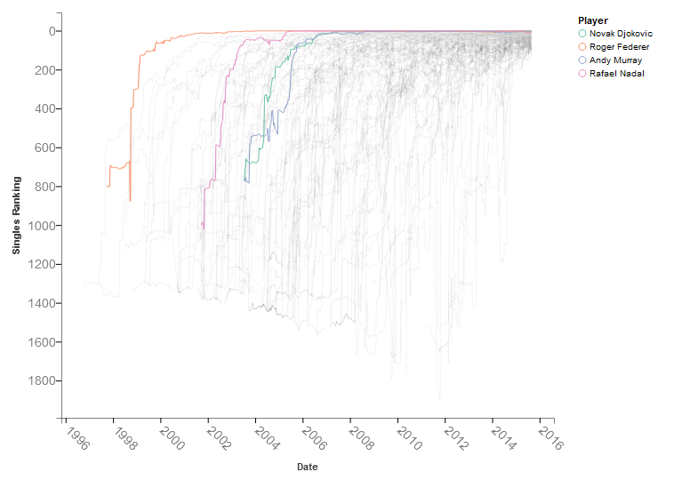
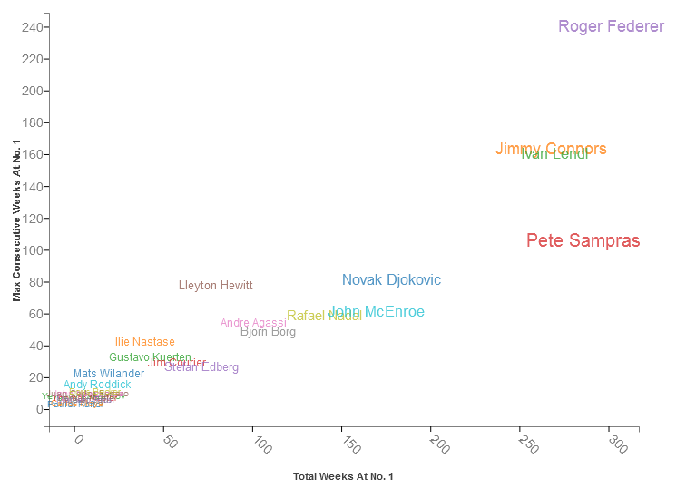
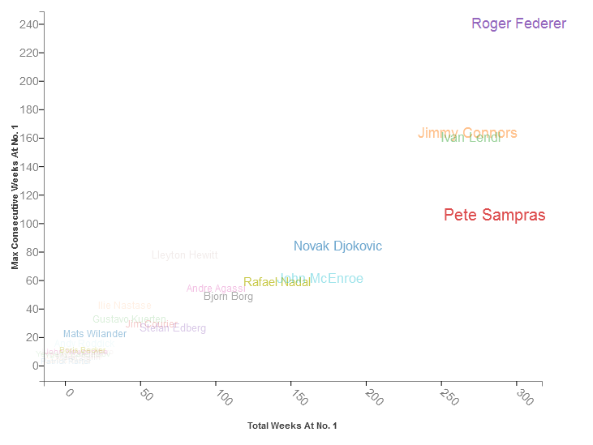

# atpRankingsHistory

A look at the big 4. The code grabs data from the ATP website, problematic as it is, and produces graphs focusing on Djokovic, Federer, Nadal, and Murray, and also all players who have achieved a number 1 ranking at some point.

## The rise and dominance of the big 4

## All time greats
Size is based on years ended with number 1 ranking.

Opacity based on number of slams.

